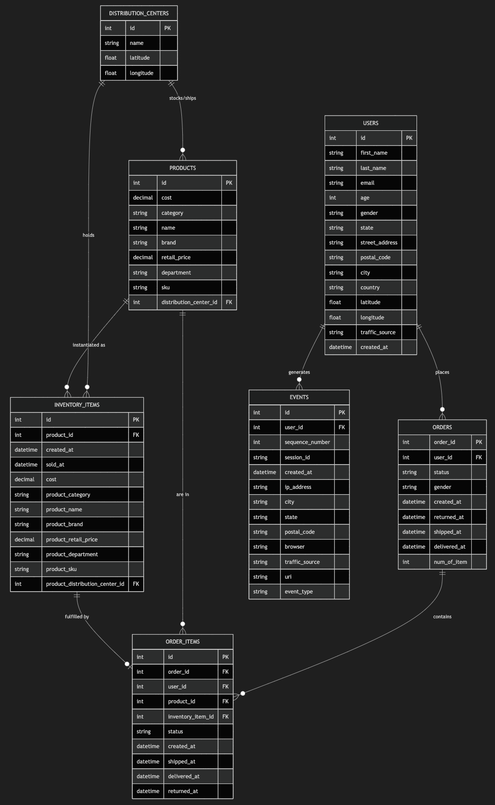
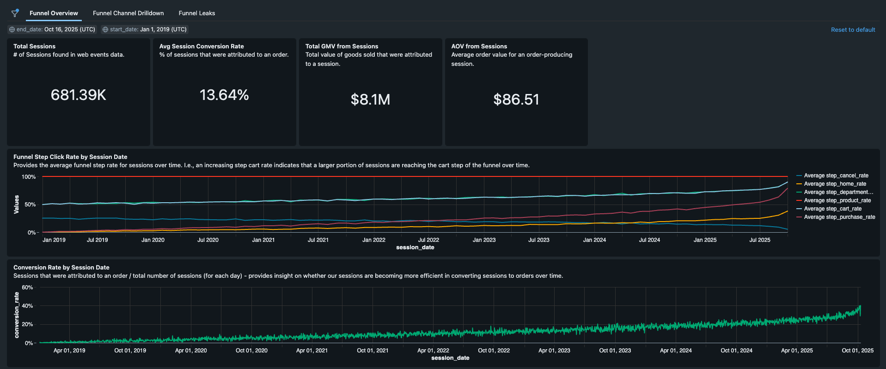
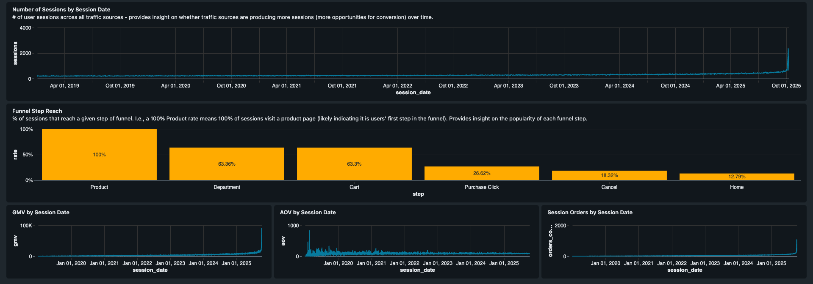
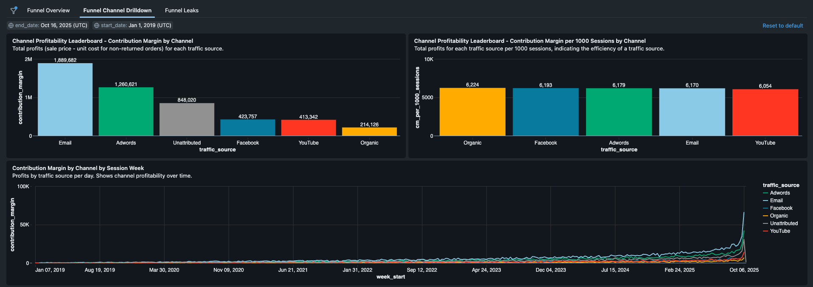
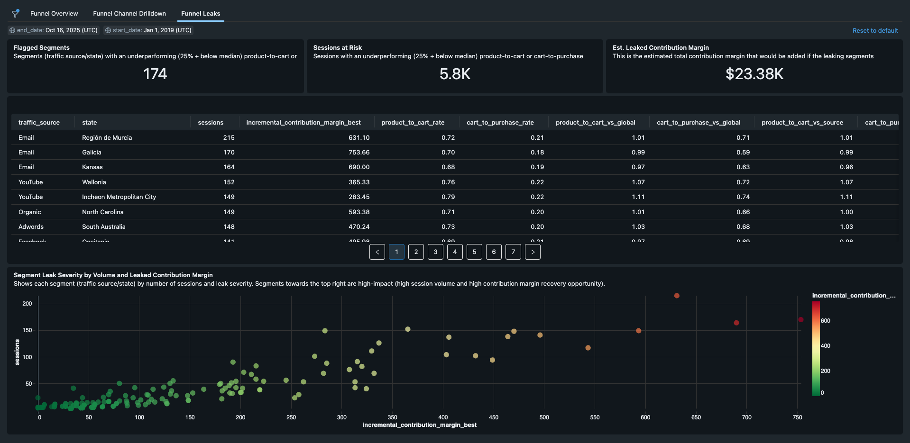
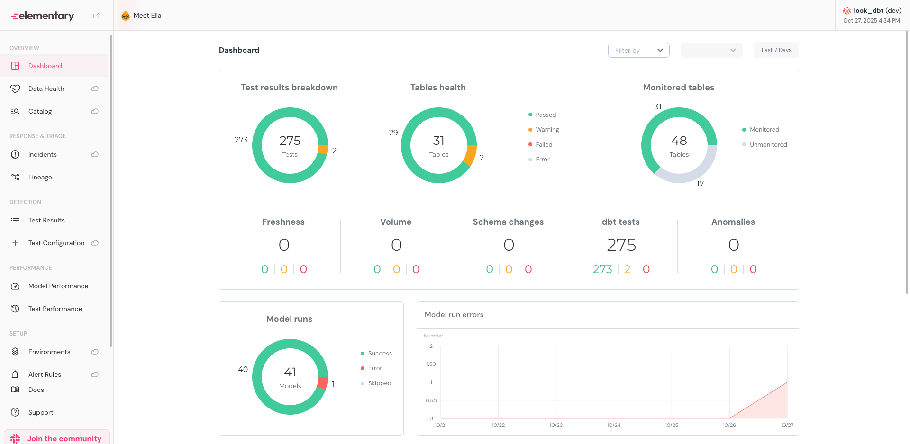
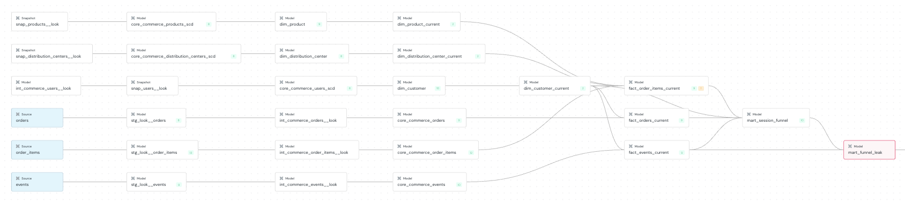
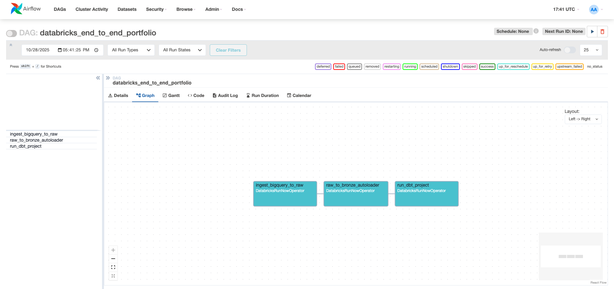

# The Look E-Commerce Analytics Project

## Overview
This project demonstrates how **data quality** and **actionable analytics** enable an organization to make informed, impactful decisions. Using a fictitious e-commerce company — **The Look** — we explore a complete data pipeline that ingests, transforms, and analyzes operational data to optimize business margins through insights.

The Look aims to improve profitability by **understanding its current and historical performance** across areas such as user behavior, orders, inventory, and product management. This repository showcases best practices in **data engineering**, **data modeling**, and **data quality monitoring**.

---

## Purpose
The goal is to simulate how organizations make data-informed decisions:
- Gather **accurate, consistent, and complete data**.
- Transform data into **actionable insights**.
- Use dashboards to **interpret patterns and drive improvement**.

The Look uses data to improve its margins.

---

## Project Architecture
### Data Source
- **GCP BigQuery Dataset:** [The Look E-Commerce Public Dataset](https://console.cloud.google.com/marketplace/product/bigquery-public-data/thelook-ecommerce)
- **Entities:** Distribution Centers, Events, Inventory Items, Orders, Order Items, Products, Users

### Ingestion Pipeline
#### 1. BigQuery → Raw Layer (AWS S3)
- **Script:** `/ingestion/thelook_ingest/ingest_bigquery_to_raw.py`
- **Engine:** Databricks Job running PySpark on a Spark Cluster
- **Features:**
  - Incremental ingestion with **high-watermark cursors**
  - Append-only Parquet storage (partitioned by date and timestamp)
  - Atomic and idempotent ingestion
  - Schema-stable and backfill-aware

#### 2. Raw Layer → Bronze Layer (Databricks Auto Loader)
- **Script:** `/ingestion/thelook_ingest/raw_to_bronze_autoloader.py`
- **Features:**
  - Exactly-once ingestion with checkpointing
  - Automatic schema evolution
  - Managed through Databricks Unity Catalog
  - Reads directly from S3 via Unity Catalog Volume

---

## Data Transformation
### Layers
1. **Bronze:** Raw ingested data.
2. **Silver:** Cleaned and conformed data using **dbt Core**.
3. **Gold:** Business-ready, analytics-optimized data marts.

### dbt Model Strategy
- **Staging (Silver):** Deduplication, normalization, and schema consistency. `/look_dbt/models/staging`
- **Intermediate (Silver):** Conformed data models with standardized business logic. `/look_dbt/models/intermediate`
- **Marts (Gold):** Dimensional/fact tables and marts tables for speedy consumption for analytics and dashboards. `/look_dbt/models/marts`

---

## Data Quality Framework
Ensures that The Look’s data represents reality across six core dimensions:
1. **Accuracy**
2. **Completeness**
3. **Consistency**
4. **Validity**
5. **Uniqueness**
6. **Timeliness**

### Actionable Data
Good quality data must also be **understandable** and **actionable**, leading directly to business improvements.

---

## dbt Project Highlights
- Incremental models with **MERGE upserts**
- **dbt tests** covering referential integrity, nulls, unique IDs, acceptable ranges/values, business-specific logic
- **Partitions and Clusters** used for efficient Spark file reads and queries
- **SCD2 (Slowly Changing Dimensions)** for Users, Products, and Distribution Centers
- **Elementary Monitoring** integration for data quality checks
- **Semantic Layer** to ensure consistent business metrics

---

## Dashboards and Reporting
Dashboards are built in **Databricks** on top of the Gold (marts) models, providing analysis of user web events and their attribution to orders:
- **Funnel Overview**
- **Funnel Channel Drilldown & Profitability**
- **Funnel Leaks**

**Funnel Overview**

**Funnel Channel & Profitability Drilldown**

**Funnel Leaks Analysis**

**Direct analysis of orders/order items (non session-related) to be completed later**

## Monitoring & Observability (Elementary)
- **Freshness SLAs:** Layer-dependent (hours for staging, days for marts)
- **Volume & Schema Drift Detection**
- **Column-level Anomalies** (price, conversion rates, margins)

**Elementary Dashboard - Data Health**

**Elementary Table Linage**

## Airflow Orchestration
Used Docker compose to locally spin up Airflow and execute a DAG with 3 Databricks Jobs tasks: `/airflow-dbx/dags/databricks_pipeline_dag.py`
1. Ingest data from GCP BQ and append it to our s3 raw layer.
2. Autoload newly added data in the raw layer to our Bronze layer as Delta tables.
3. Run our dbt project (dbt deps, seed, run, test) 

---

## Summary
This project exemplifies **modern data stack practices** for an analytics-driven organization:
- Incremental ingestion (BigQuery → S3)
- Auto Loader for exactly-once ingestion
- dbt for transformation and lineage
- SCD2 dimensional modeling
- Actionable dashboards
- End-to-end observability with Elementary

It serves as a **portfolio-ready template** for showcasing **data engineering**, **dbt modeling**, and **data quality monitoring** skills in Databricks.

---

> _“Truth drives improvement — data drives truth.”_
